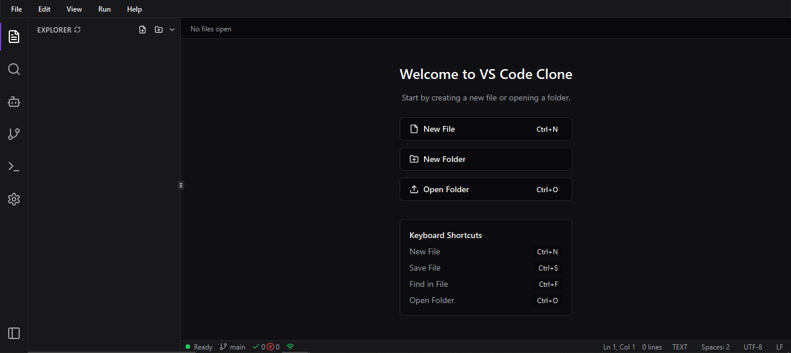

## Project info

**URL**: https://lovable.dev/projects/63e2082c-8103-49a7-a17a-063fe72a67cb

# VS Code Clone 💻

A beautiful, functional Visual Studio Code clone built with React, TypeScript, and TailwindCSS for a hackathon project. Simple yet beautiful!



## ✨ Features
- **VS Code Experience**: Just like the real thing, but made by you!
- **Custom File Icons**: Different icons for different file types
- **AI Assistant**: Chat with AI powered by Pollinations API
- **File Explorer**: Browse, create, and manage files
- **Monaco Editor**: Real syntax highlighting for many languages
- **Dark Theme**: Easy on the eyes, perfect for coding
- **Responsive Layout**: Resize panels just like in VS Code

## 🚀 Getting Started

Super simple to get started:

```bash
# Clone the repo
git clone https://github.com/deepsuthar496/syntax-spark-editor
cd syntax-spark-editor

# Install dependencies
npm i

# Start the dev server
npm run dev
```
Then open http://localhost:8080 in your browser - that's it!

## 💖 Made with [Love by lovable](https://lovable.dev/) X [Github Copilot](https://github.com/features/copilot)

This project was created as part of a hackathon, showcasing how GitHub Copilot and Lovable can accelerate web development with AI.
